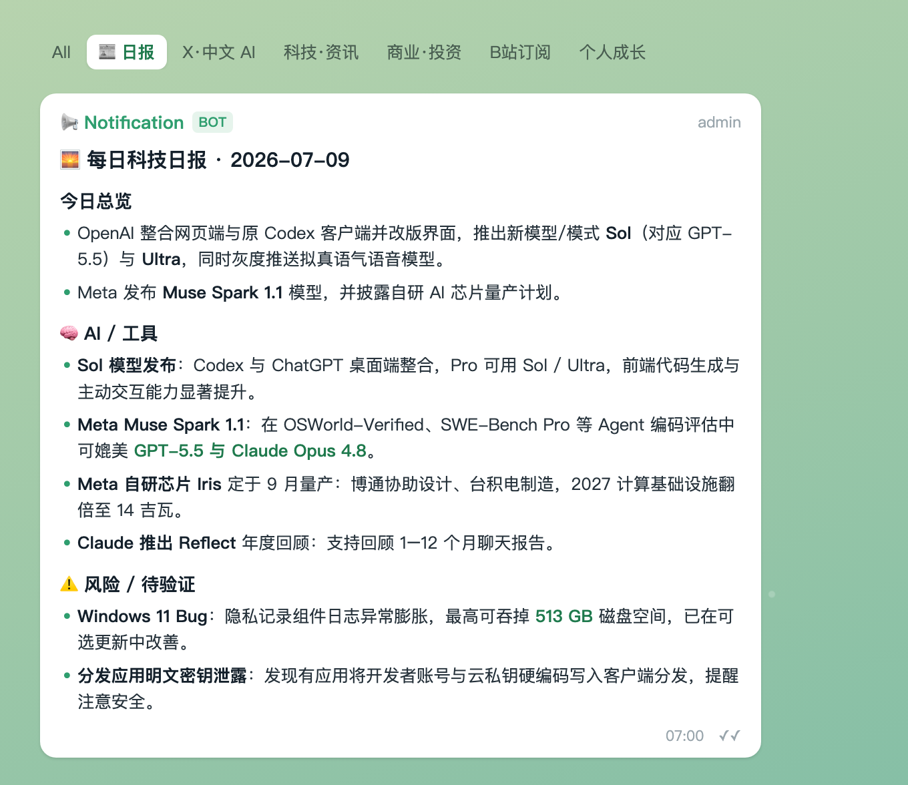
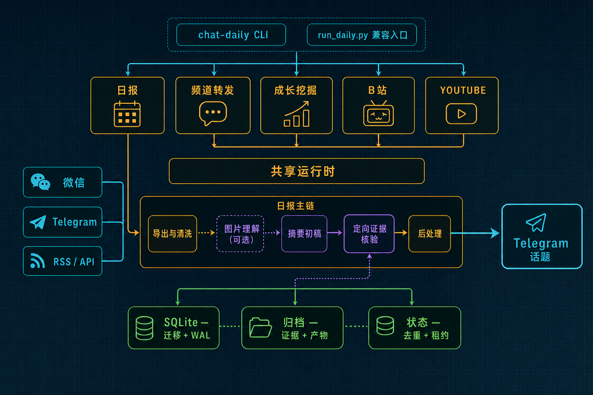

# chat-daily-tg

每天自动导出微信和 Telegram 群消息，整理成统一日报推送到 Telegram，同时本地归档。

在日报之外还有三条独立管线：**频道转发**（选定频道原文逐条转成卡片，跳过 LLM）、**成长内容挖掘**（从群聊里挖个人成长素材、A/B 择优推送）、**B站订阅 digest**（白名单 UP 新视频卡片，已迁至 r4s 运行）。四条管线共用同一套配置、路由表和归档目录。

## 日报示例

推送到 Telegram 的富文本日报，按话题分区、`今日总览 / AI·工具 / 风险` 分节（示意图，内容脱敏）：



## 架构

数据流、设计取舍与横切关注点见 **[docs/ARCHITECTURE.md](docs/ARCHITECTURE.md)**；部署、日志与故障排查见 **[docs/runbook.md](docs/runbook.md)**。



<sub>源文件 `diagram/chat-daily-architecture.svg`，改完用 headless Chrome 截图重渲：`chrome --headless=new --force-device-scale-factor=2 --window-size=940,660 --screenshot=chat-daily-architecture.png file://$PWD/diagram/chat-daily-architecture.svg`</sub>

## 功能清单

### 每日日报（主管线）

| 功能 | 说明 |
|---|---|
| 微信群导出 | 通过 [wx-cli](https://github.com/jackwener/wx-cli) 解密读取本地微信消息库，导出指定群前一天聊天 |
| Telegram 群导出 | 通过 [tg-cli](https://github.com/public-clis/tg-cli) 本地 SQLite 读取 |
| LLM 摘要 | 生成适合手机阅读的统一简报（默认经本机 CLIProxyAPI 调 Gemini，见「模型配置」） |
| 二次事实核验 | summary 初稿后再跑 verifier，修正无证据实体补全、主语错贴、跨消息缝合 |
| Embedding 证据检索（可选） | 用 Gemini embedding 为高风险 claim 从当天原文检索候选证据，注入 verifier |
| 图片理解（可选） | 开启后用多模态模型分析聊天中的图片，高分图并入日报 |
| 富消息内嵌图 | 日报正文与配图合成**单条** Telegram 富消息（Bot API 10.x `sendRichMessage`）；图片经 Cloudflare KV 短时中转，发后即删。任一环失败自动回落「全文一条 + 尾图独立一条」 |
| Telegram 推送 | 通过 Bot API 推到路由表指定的话题 |
| 本地归档 | 每天的原始导出、详细总结、核验记录、图片分析存到 `~/chat-daily/archive/` |
| 重复话题降权 | 近 7 天重复话题自动降权，避免旧闻反复出现 |
| 短期热点跟踪 | 近 14 天内还活着的短期机会（存 SQLite，派生 `hot-leads/` 视图） |

### 频道转发

选定 Telegram 频道的消息**逐条原样**转成卡片，完全跳过 LLM 总结。公开频道走链接预览卡；私有频道用登录 session 下载媒体、经 bot 重新上传（媒体推送后即删，不留二进制）。每 2 小时增量跑一次，靠 msg_id 高水位只抓新消息。

### 成长内容挖掘（growth mining）

从指定群聊里挖掘个人成长相关片段，生成 A/B 两种风格的卡片（确定性模板 vs LLM 叙事），由**异源 judge**（grok-4.5）择优推送，原文切片存本地 `growth/segments/`。用户 DM 反馈经 `getUpdates` 每日轮询收集，周六合并进 rubric。

### B站订阅 digest

白名单 UP 新视频卡片（封面 + 一句话摘要 + 观看按钮）。**已迁至 r4s cron 运行**，Mac 侧的 launchd label 在 `install-launchd.sh` 里故意注释掉，代码仍在本仓库。

## 项目结构

```
.
├── run_daily.py                    # 全部四条管线的统一入口（靠 flag 分流）
├── src/chat_daily_tg/
│   ├── wx_exporter.py              # 微信聊天导出（含图片按分下载）
│   ├── telegram_exporter.py        # Telegram 聊天导出
│   ├── telegram_media.py           # TG 图片旁路下载（tg-cli 不存媒体）
│   ├── context_builder.py          # 上下文拼装
│   ├── summarizer.py               # LLM 摘要和二次事实核验
│   ├── evidence_index.py           # Embedding 证据索引和检索
│   ├── vision.py                   # 图片理解、引用池、[IMGn] 解析
│   ├── img_relay.py                # Cloudflare KV 图片中转（富消息用）
│   ├── card_renderer.py            # PNG 卡片渲染（headless Chrome）
│   ├── prompts.py                  # Prompt 模板
│   ├── post_process.py             # 后处理
│   ├── repeat_topics.py            # 重复话题降权
│   ├── cross_group_cluster.py      # 跨群聚类
│   ├── death_signals.py            # 失效信号检测
│   ├── research_loop.py            # 长期追踪循环
│   ├── hot_leads.py                # 短期热点管理
│   ├── permanent_md.py             # 长期机会库维护
│   ├── raw_channels.py             # 频道转发：公开频道卡片
│   ├── private_media.py            # 频道转发：私有频道媒体下载
│   ├── raw_seen.py                 # 已推送去重与增量高水位
│   ├── growth_miner.py             # 成长挖掘：切片与素材提取
│   ├── growth_cards.py             # 成长挖掘：A/B 构卡与评审
│   ├── growth_store.py             # 成长挖掘：存储与 rubric
│   ├── growth_weekly.py            # 成长挖掘：周报与 rubric 合并
│   ├── bilibili_fetcher.py         # B站抓取（api / opencli 双 transport）
│   ├── bilibili_digest.py          # B站卡片编排
│   ├── tg_sender.py                # Telegram 发送（含富消息）
│   ├── notifier.py                 # 通知封装
│   ├── llm_client.py               # LLM API 客户端
│   ├── db.py                       # SQLite 数据访问
│   ├── sqlite_util.py              # 连接与 schema 初始化
│   ├── archive.py                  # 归档与媒体保留期清理
│   ├── sanitize.py                 # 文本清洗
│   ├── media.py                    # 媒体候选打分
│   ├── paths.py                    # 路径常量
│   ├── env.py                      # 环境变量加载、代理清洗
│   ├── config.py                   # 配置解析
│   └── logging_setup.py            # 日志初始化与脱敏
├── scripts/
│   ├── install-launchd.sh          # launchd 安装（agent + channels + growth ×2）
│   ├── run_*_guarded.sh            # 各管线 guard wrapper（venv 预检 + 代理 + 告警）
│   ├── guard_common.sh             # guard 共享逻辑
│   ├── sync_tg_targets.sh          # 路由表同步到 r4s / bwg
│   ├── run_bilibili_r4s.sh         # B站 digest（在 r4s 上跑）
│   ├── tg_media_dump.py            # telethon 媒体下载（借 kabi-tg-cli 解释器）
│   ├── migrate_jsonl_to_sqlite.py  # 一次性迁移脚本（2026-06-29 已执行）
│   └── weekly_media_rules_review.py # 周媒体规则回顾
├── launchd/                        # plist 模板（由 install-launchd.sh 渲染）
├── docs/spark/                     # 设计文档
└── tests/
```

数据目录（独立于代码仓库）：

```
~/chat-daily/
├── config.yaml          # 主配置
├── .env                 # 环境变量（权限 600）
├── chat-daily.db        # SQLite 主库（见下表）
├── permanent.md         # 长期机会库（由 DB 派生的 Markdown 视图）
├── hot-leads/           # 近 14 天短期热点（由 DB 派生的视图）
├── growth/segments/     # 成长挖掘的原文切片 + INDEX.md 快查索引
├── archive/             # 每天的原始导出、详细总结、核验证据、图片分析
└── logs/                # 运行日志（日报 / channels / growth 分开）
```

`chat-daily.db` 的表（2026-06-29 从 JSONL 迁移而来）：

| 表 | 内容 |
|---|---|
| `permanent` | 长期机会库，按 `fingerprint` 唯一（URL 会先剥离 utm_* 等跟踪参数再算指纹） |
| `hot_leads` | 短期热点 |
| `repeat_topics` | 近 7 天重复话题 |
| `growth_segments` / `growth_mined_days` / `growth_ab_log` | 成长挖掘的切片、天级幂等标记、A/B 判决记录 |

> 数据目录里残留的 `permanent.jsonl` / `repeat_topics.jsonl` 是迁移前的旧文件，**已不是事实源**，代码不再读取。

## 配置

### 微信导出前置（wx-cli）

微信侧依赖 [wx-cli](https://github.com/jackwener/wx-cli) 读取本机微信客户端的本地消息库：

```bash
npm install -g @jackwener/wx-cli
wx init                # 检测微信数据目录并扫描解密密钥
wx export "<群名>" --since 2026-06-10 --until 2026-06-11 --limit 10   # 验证能导出
```

说明：

- `wx_exporter` 优先调用 PATH 上的 `wx`，找不到时回退 `/opt/homebrew/bin/wx`
- 只能读取本机已登录微信桌面客户端同步下来的消息，换机或重装后需重新 `wx init`
- 只用 Telegram 侧时可以不装：`sources.wechat.groups` 留空即可

### 环境变量

写到 `~/chat-daily/.env`，建议权限 `600`：

| 变量 | 必需 | 说明 | 获取方式 |
|---|---|---|---|
| `TG_BOT_TOKEN` | Yes | Telegram bot token | [@BotFather](https://t.me/BotFather) |
| `TG_CHAT_ID` | Yes | 推送目标 chat_id | [@userinfobot](https://t.me/userinfobot) 或 API |
| `CLIPROXY_API_KEY` | Yes | 本机 CLIProxyAPI 的 key；当前 summary / vision / judge 都走它 | 本机 CLIProxyAPI 配置 |
| `DEEPSEEK_API_KEY` | No | `llm` 别名用（成长挖掘默认走它）；日报摘要已不用 | [api-docs.deepseek.com](https://api-docs.deepseek.com/) |
| `GOOGLE_API_KEY` | No | Gemini embedding API key（开启 `models.embedding.enabled` 时需要） | Google AI Studio / Gemini API |
| `CF_KV_API_TOKEN` | No | Cloudflare KV 图片中转（开启 `img_relay` 时需要）；建议用最小权限 token（仅 Account / Workers KV Storage / Edit） | Cloudflare dashboard |
| `VISION_API_KEY` | No | 旧 vision 后端（qwenproxy）的 key，当前配置未使用 | 自行准备 OpenAI 兼容接口 |

必需性取决于开了哪些管线：只跑日报需要前三个；成长挖掘另需 `DEEPSEEK_API_KEY`；富消息内嵌图另需 `CF_KV_API_TOKEN`。

### config.yaml

主配置文件在 `~/chat-daily/config.yaml`：

```yaml
sources:
  wechat:
    groups:
      - "<wechat-group-name>"
  telegram:
    enabled: true
    db_path: "~/Library/Application Support/tg-cli/messages.db"
    sync_before_export: true
    chats:
      - id: "<telegram-chat-id>"
        name: "<telegram-chat-name>"
        limit: 500

models:
  summary:
    endpoint: "http://127.0.0.1:8317/v1"     # 本机 CLIProxyAPI
    model: "gemini-3.5-flash-low"
    api_key_env: "CLIPROXY_API_KEY"
    max_tokens: 32000
    timeout: 600.0
  vision:
    enabled: true
    endpoint: "http://127.0.0.1:8317/v1"
    model: "gemini-3.5-flash-low"
    api_key_env: "CLIPROXY_API_KEY"
    timeout: 120.0
  embedding:
    enabled: true
    endpoint: "https://generativelanguage.googleapis.com/v1beta"
    model: "gemini-embedding-2"
    api_key_env: "GOOGLE_API_KEY"
    dimension: 768
    top_k: 8
    min_similarity: 0.35

telegram:
  bot_token_env: "TG_BOT_TOKEN"
  chat_id_env: "TG_CHAT_ID"
```

旧版顶层 `groups:` 仍可读取，会自动当作 `sources.wechat.groups`。

图片理解是可选功能。开启 `models.vision.enabled` 后，脚本会先用聊天上下文筛选可能有价值的图片，再把有本地路径且通过预筛的图片交给多模态模型。图片理解结果会作为额外来源进入日报；失败时只记录 warning，不影响文本日报发送。

Embedding 证据检索也是可选功能。开启 `models.embedding.enabled` 后，脚本会把当天导出的消息切成带来源的 chunk，调用 Gemini embedding 建立当天本地 `evidence.sqlite`，再从 summary 初稿中抽取高风险 claim（版本号、发布、封禁、涨价、额度变化、榜单、金额等）检索 top-k 原文证据。检索结果会写入 `evidence-context.md` 并注入二次 verifier；verifier 仍以原始聊天为准，embedding 结果只是候选证据，不能替代事实判断。

不要把真实 API key 写进 `config.yaml` 或提交到仓库；只写 `api_key_env` 变量名，真实值放在 `~/chat-daily/.env`。

### 模型配置

除了 `models.*`，配置里还有几个顶层**模型别名**，供不同管线按名引用：

| 别名 | 当前指向 | 谁在用 |
|---|---|---|
| `models.summary` | gemini-3.5-flash-low @ CLIProxyAPI | 日报摘要与核验 |
| `models.vision` | gemini-3.5-flash-low @ CLIProxyAPI | 图片理解 |
| `models.embedding` | gemini-embedding-2 @ Google | 证据检索 |
| `llm` | deepseek-v4-pro @ api.deepseek.com | 成长挖掘与 B 卡（wrapper 固定传 `--model llm`） |
| `grok` | grok-4.5 @ CLIProxyAPI | 成长 A/B judge |

成长挖掘的 judge 刻意与作者**异源**（B 卡由 `llm` 写、judge 用 `grok`），避免 LLM 自评的自偏好。`Growth.judge_model` 设为空即回落同源。

CLIProxyAPI（`127.0.0.1:8317`）是本机进程，summary / vision / judge 三者共依赖它——它不在，日报正文就没了。跑在代理环境下时 `NO_PROXY` 必须放行 `127.0.0.1`。

## 归档产物

每天的归档目录位于 `~/chat-daily/archive/YYYY/MM/DD/`，常见文件：

| 文件 | 说明 |
|---|---|
| `wechat-*.md` / `telegram-*.md` | 当天原始导出 |
| `concise.md` | 最终 Telegram 精简版 |
| `summary.md` | 最终本地详细版 |
| `verification.json` | verifier 检查过的 claim、状态、理由、证据和置信度 |
| `evidence.sqlite` | 当天消息 chunk 的本地 embedding 索引（开启 embedding 时生成） |
| `evidence-context.md` | 从初稿 claim 检索出的候选证据（开启 embedding 时生成） |
| `vision.md` / `vision.jsonl` | 图片理解结果（**仅入选的**，开启 vision 且有高价值图片时生成） |
| `vision-audit.jsonl` | 图片理解全量留痕（含落选与失败），供事后校准入选阈值 |
| `media_candidates.jsonl` | 图片/媒体候选记录 |
| `tg_media/` / `wx_media/` | 当天下载的图片，默认保留 14 天后自动清理 |

## 使用

### 手动运行

```bash
cd <repo>
source .venv/bin/activate

python run_daily.py                      # 跑昨天的日报
python run_daily.py --date 2026-04-17    # 补跑指定日期
python run_daily.py --no-push            # 干跑，不推送
python run_daily.py --channels-only      # 只跑频道转发
python run_daily.py --growth-only        # 只跑成长挖掘
python run_daily.py --bilibili-only      # 只跑 B站 digest（正常在 r4s 上跑）
```

完整 flag 见 `python run_daily.py --help`。

### 安装 launchd 定时任务（macOS）

```bash
./scripts/install-launchd.sh
```

装 4 个 label：日报（6:30，另有 9:00 / 13:00 catch-up）、频道转发（6–22 每 2 小时）、成长挖掘（9:30 / 15:30 / 21:30）、成长周报（周六 9:45）。**实际调度以 plist 为准**——`config.yaml` 里的 `schedule` 段当前没有代码读取。

B站 digest 的 label 在脚本里被故意注释掉（已迁 r4s），不要装回，会双跑。

### 路由表同步

TG 话题路由表的唯一事实源是 Mac 上的 `~/qwenproxy/.tg-notify-targets.json`。改完同步到 fleet：

```bash
./scripts/sync_tg_targets.sh --check     # 只看各机 diff
./scripts/sync_tg_targets.sh             # 推送到 r4s / bwg
```

### 测试

```bash
uv run --extra dev pytest -q       # 359 tests
```

测试依赖在 `pyproject.toml` 的 `[project.optional-dependencies].dev` 里，**不在默认 `.venv`**——直接跑 `pytest` 会报 `No module named pytest`。

本机若有 socks 代理变量（Shadowrocket 会往环境里塞 `ALL_PROXY`），跑测试前加 `env -u ALL_PROXY -u all_proxy`；`tests/conftest.py` 已全局清代理，但 shell 层的污染仍会影响 uv 自身。

## 依赖工具

| 工具 | 用途 |
|---|---|
| [wx-cli](https://github.com/jackwener/wx-cli) | 微信本地消息库解密导出（`npm i -g @jackwener/wx-cli`） |
| [tg-cli](https://github.com/public-clis/tg-cli) | Telegram 本地 SQLite 导出（**只存文本**，图片靠 telethon 旁路） |
| kabi-tg-cli | 私有频道 / 图片下载借用它的 telethon 解释器与登录 session |
| CLIProxyAPI | 本机模型代理（`127.0.0.1:8317`），summary / vision / judge 共用 |
| [DeepSeek API](https://api-docs.deepseek.com/) | `llm` 别名，成长挖掘 |
| Cloudflare Workers + KV | 富消息内嵌图的短时中转（发后即删） |
| [BotFather](https://t.me/BotFather) | 创建 Telegram bot |
| [userinfobot](https://t.me/userinfobot) | 获取 Telegram chat_id |
| headless Chrome | PNG 卡片渲染与架构图重渲 |
