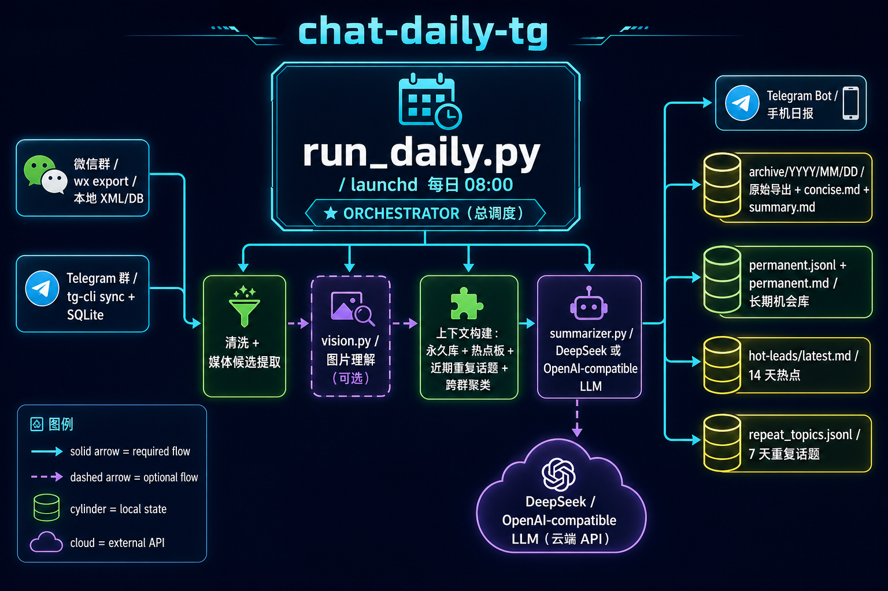

# chat-daily-tg

每天自动导出微信和 Telegram 群消息，整理成统一日报推送到 Telegram，同时本地归档。

## 架构



## 功能清单

| 功能 | 说明 |
|---|---|
| 微信群导出 | 通过本地 XML/DB 读取指定微信群前一天聊天 |
| Telegram 群导出 | 通过 [tg-cli](https://github.com/public-clis/tg-cli) 本地 SQLite 读取 |
| LLM 摘要 | 调用 DeepSeek 生成适合手机阅读的统一简报 |
| 图片理解（可选） | 开启后用多模态模型分析聊天中的图片，结果并入日报 |
| Telegram 推送 | 通过 Bot API 把简报推到指定 chat |
| 本地归档 | 每天的原始导出、详细总结、短期热点、长期机会库存到 `~/chat-daily` |
| 重复话题降权 | 近 7 天重复话题自动降权，避免旧闻反复出现 |
| 短期热点跟踪 | `hot-leads/` 保留近 14 天内还活着的短期机会 |

## 项目结构

```
.
├── run_daily.py                    # 主入口
├── src/chat_daily_tg/
│   ├── wx_exporter.py              # 微信聊天导出
│   ├── telegram_exporter.py        # Telegram 聊天导出
│   ├── context_builder.py          # 上下文拼装
│   ├── summarizer.py               # LLM 摘要
│   ├── vision.py                   # 图片理解
│   ├── prompts.py                  # Prompt 模板
│   ├── post_process.py             # 后处理
│   ├── repeat_topics.py            # 重复话题降权
│   ├── cross_group_cluster.py      # 跨群聚类
│   ├── death_signals.py            # 失效信号检测
│   ├── research_loop.py            # 长期追踪循环
│   ├── hot_leads.py                # 短期热点管理
│   ├── permanent_md.py             # 长期机会库维护
│   ├── tg_sender.py                # Telegram 发送
│   ├── notifier.py                 # 通知封装
│   ├── llm_client.py               # LLM API 客户端
│   ├── db.py                       # 本地数据库
│   ├── archive.py                  # 归档
│   ├── sanitize.py                 # 文本清洗
│   ├── media.py                    # 媒体处理
│   ├── paths.py                    # 路径常量
│   ├── env.py                      # 环境变量加载
│   ├── config.py                   # 配置解析
│   └── logging_setup.py            # 日志初始化
├── scripts/
│   ├── install-launchd.sh          # launchd 安装脚本
│   ├── research_loop.py            # 研究循环独立运行
│   └── weekly_media_rules_review.py # 周媒体规则回顾
├── launchd/
│   └── com.chat-daily-tg.agent.plist
└── tests/
```

数据目录（独立于代码仓库）：

```
~/chat-daily/
├── config.yaml          # 主配置
├── .env                 # 环境变量（权限 600）
├── permanent.jsonl      # 长期机会库（JSONL）
├── permanent.md         # 长期机会库（Markdown）
├── repeat_topics.jsonl  # 近 7 天重复话题
├── hot-leads/           # 近 14 天短期热点
├── archive/             # 每天的原始导出和详细总结
└── logs/                # 运行日志
```

## 配置

### 环境变量

写到 `~/chat-daily/.env`，建议权限 `600`：

| 变量 | 必需 | 说明 | 获取方式 |
|---|---|---|---|
| `DEEPSEEK_API_KEY` | Yes | DeepSeek API key | [api-docs.deepseek.com](https://api-docs.deepseek.com/) |
| `TG_BOT_TOKEN` | Yes | Telegram bot token | [@BotFather](https://t.me/BotFather) |
| `TG_CHAT_ID` | Yes | 推送目标 chat_id | [@userinfobot](https://t.me/userinfobot) 或 API |
| `VISION_API_KEY` | No | 图片理解 API key（开启 vision 时需要） | 自行准备 OpenAI 兼容接口 |

### config.yaml

主配置文件在 `~/chat-daily/config.yaml`：

```yaml
sources:
  wechat:
    groups:
      - "<wechat-group-name>"
  telegram:
    enabled: true
    db_path: "~/Library/Application Support/tg-cli/messages.db"
    sync_before_export: true
    chats:
      - id: "<telegram-chat-id>"
        name: "<telegram-chat-name>"
        limit: 500

models:
  summary:
    endpoint: "https://api.deepseek.com"
    model: "deepseek-v4-pro"
    api_key_env: "DEEPSEEK_API_KEY"
    max_tokens: 12000
    timeout: 600.0
    extra_body:
      reasoning_effort: "max"
      thinking:
        type: "enabled"
  vision:
    enabled: false
    endpoint: "<openai-compatible-vision-endpoint>"
    model: "<vision-model>"
    api_key_env: "VISION_API_KEY"

telegram:
  bot_token_env: "TG_BOT_TOKEN"
  chat_id_env: "TG_CHAT_ID"
```

旧版顶层 `groups:` 仍可读取，会自动当作 `sources.wechat.groups`。

图片理解是可选功能。开启 `models.vision.enabled` 后，脚本会先用聊天上下文筛选可能有价值的图片，再把有本地路径且通过预筛的图片交给多模态模型。图片理解结果会作为额外来源进入日报；失败时只记录 warning，不影响文本日报发送。

## 使用

### 手动运行

```bash
cd <repo>
source .venv/bin/activate
python run_daily.py
python run_daily.py --date 2026-04-17
```

### 安装 launchd 定时任务（macOS）

```bash
./scripts/install-launchd.sh
```

### 测试

```bash
pytest -v
```

## 依赖工具

| 工具 | 用途 |
|---|---|
| [tg-cli](https://github.com/public-clis/tg-cli) | Telegram 本地 SQLite 导出 |
| [DeepSeek API](https://api-docs.deepseek.com/) | 默认 LLM 摘要 |
| [BotFather](https://t.me/BotFather) | 创建 Telegram bot |
| [userinfobot](https://t.me/userinfobot) | 获取 Telegram chat_id |
