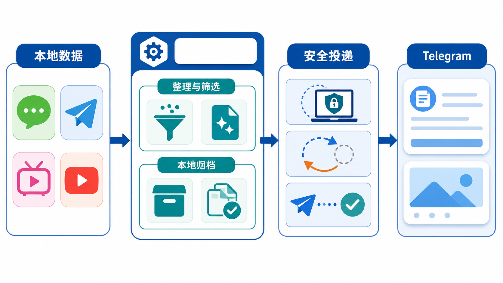

# chat-daily-tg

把本机已经拥有的微信、Telegram、Bilibili 和 YouTube 内容整理成简报或卡片，再投递到 Telegram，并把过程材料保存在本地。

> 这不是“一键部署的云服务”。它是一个 Python 3.11+ 模块化单体，需要你自行准备数据源、模型接口和 Telegram Bot。第一次使用应先跑无密钥的隔离测试，再用测试群验证，最后才考虑定时运行。



<sub>从本地已有内容到 Telegram 的四步流程：整理与筛选、本地归档、安全投递。图中不包含真实聊天、密钥或账号信息。</sub>

## 30 秒理解

| 问题 | 回答 |
|---|---|
| 它做什么？ | 读取你已有的消息或订阅，整理后发到 Telegram，同时保留本地归档。 |
| 什么在 Mac 上跑？ | `daily` 日报、`channels` 频道转发、`growth` 成长内容挖掘。 |
| 什么在 r4s 上跑？ | Bilibili 和 YouTube digest；仓库中的 wrapper 是现有环境脚本，不是通用安装器。 |
| 会把数据上传到哪里？ | 只有你启用的 LLM、Telegram 和内容平台接口。原始归档和状态默认留在 `~/chat-daily/`。 |
| 增强功能失败会怎样？ | 设计目标是“正文优先”：图片、富消息、持久化等失败时应降级，不能阻塞正文。 |
| 测试会真的发 Telegram 吗？ | `tests/e2e` 不会。它用临时 SQLite、临时目录和 HTTP mock，是 hermetic E2E，不是真实生产 E2E。 |

## 最短安全试跑：无密钥、不发消息

这一步只确认代码能安装、CLI 能启动，并验证“CLI → 配置 → SQLite → 归档 → Telegram HTTP 边界”的隔离链路。它不会连接 Telegram、LLM、微信、B站或 YouTube。

```bash
git clone "REPOSITORY_URL_HERE"
cd chat-daily-tg

uv sync --extra dev --locked
uv run chat-daily --help
uv run pytest -q -m e2e tests/e2e
```

预期结果：CLI 显示 `daily / channels / growth / bilibili / youtube` 子命令；E2E 测试通过。这里的“通过”只证明本地契约和交付不变量，没有证明真实凭据、代理、Telegram 权限或生产调度可用。

## 前置条件

必需：

- macOS 或 Linux；生产拓扑中的 daily/channels/growth 面向 macOS。
- Python 3.11 或更高版本。
- [uv](https://docs.astral.sh/uv/)；依赖由 `uv.lock` 固定。
- Git。

按功能选装：

- 微信日报：可在本机读取微信数据的 `wx-cli`。
- Telegram 消息导出：维护本地 `messages.db` 的 `tg-cli`。
- 真实投递：Telegram Bot token 和目标 chat ID。
- 日报或摘要：一个与 OpenAI Chat Completions 兼容的模型端点及密钥。
- Bilibili/YouTube：只建议在理解 `scripts/run_*_r4s.sh` 的机器路径、代理和 cron 前提后启用。

## 安装

```bash
git clone "REPOSITORY_URL_HERE"
cd chat-daily-tg
uv sync --extra dev --locked
uv run chat-daily --help
mkdir -p ~/chat-daily
```

项目代码与运行数据分开：代码留在仓库；配置、密钥、日志、归档和状态放在 `~/chat-daily/`。不要把 `~/chat-daily/` 复制进仓库。

## 配置

### 1. 创建密钥文件

仓库故意不提供带真实值的 `.env`。密钥只能写在 `~/chat-daily/.env`：

```bash
install -m 600 /dev/null ~/chat-daily/.env
${EDITOR:-nano} ~/chat-daily/.env
```

按你启用的功能填写占位符：

```dotenv
TG_BOT_TOKEN=<TELEGRAM_BOT_TOKEN>
TG_CHAT_ID=<TELEGRAM_CHAT_OR_TEST_GROUP_ID>
SUMMARY_API_KEY=<OPENAI_COMPATIBLE_API_KEY>
```

保存后确认权限：

```bash
chmod 600 ~/chat-daily/.env
ls -l ~/chat-daily/.env
```

不要把真实密钥贴进 issue、PR、截图、日志或仓库中的示例文件。若密钥曾提交到 Git，删除文件并不等于安全；应立即吊销并轮换。

### 2. 创建最小 `config.yaml`

下面示例使用 Telegram 本地 SQLite 生成日报。先把所有 `<...>` 替换成你的值：

```bash
cat > ~/chat-daily/config.yaml <<'YAML'
models:
  summary:
    endpoint: "<OPENAI_COMPATIBLE_BASE_URL>"
    model: "<MODEL_NAME>"
    api_key_env: "SUMMARY_API_KEY"
    max_tokens: 16000
    timeout: 300

telegram:
  bot_token_env: "TG_BOT_TOKEN"
  chat_id_env: "TG_CHAT_ID"

sources:
  telegram:
    enabled: true
    db_path: "~/Library/Application Support/tg-cli/messages.db"
    sync_before_export: false
    chats:
      - id: "<SOURCE_TELEGRAM_CHAT_ID>"
        name: "<DISPLAY_NAME>"
        limit: 500
YAML
```

说明：

- `endpoint`、`model` 和 `api_key_env` 必须与实际模型服务匹配。
- `db_path` 是输入消息数据库，不是本项目自己的状态库。
- `sync_before_export: false` 表示只读取现有 SQLite；改成 `true` 前先单独确认 `tg-cli` 可用。
- 至少配置一个实际数据源。只有 `raw_channels` 时可以跑 `channels`，但不能生成 `daily` 日报。
- 图片理解、embedding、growth、Bilibili 和 YouTube 都是可选项；首次安装不要同时开启。

要使用微信日报，可把 Telegram `chats` 留空并添加：

```yaml
sources:
  wechat:
    groups:
      - "<WECHAT_GROUP_NAME>"
```

先在终端单独验证 `wx` 能导出该群。项目无法替你获取微信解密密钥或绕过系统权限。

### 3. 可选：频道原文转发

频道转发跳过 LLM，但配置模型块仍是当前配置模型的必填结构。把以下内容放到 `sources.telegram` 下：

```yaml
raw_card_delay_seconds: 1
raw_channels:
  - id: "<SOURCE_CHANNEL_ID>"
    name: "<DISPLAY_NAME>"
    username: "<PUBLIC_CHANNEL_USERNAME_WITHOUT_AT>"
    topic: "channels_news"
```

公开频道有 `username` 时使用链接预览；私有频道或纯媒体消息需要本地 Telegram session 下载媒体。媒体增强失败应回落到文本或占位卡，不应让其他正文停止投递。

## 第一次验证

### 第 1 层：隔离 E2E

```bash
uv run pytest -q -m e2e tests/e2e
```

它覆盖：

- 真实 `chat-daily channels run` CLI 和 feature application；
- YAML 配置、临时 SQLite、归档写入和 seen 状态；
- 成功响应后才写 seen；
- Telegram HTML 400 后降级为纯文本，且降级成功前不写 seen；
- `ALL_PROXY/all_proxy` 在入口处被清除；
- HTTP 只到 `httpx.MockTransport`，没有真实网络。

### 第 2 层：真实数据、禁止 Telegram 投递

日报：

```bash
uv run chat-daily daily run --no-push
```

频道：

```bash
uv run chat-daily channels run --no-push
```

`--no-push` 仍可能读取真实数据、调用 LLM、写本地归档或状态；它只保证不做 Telegram 正文投递。它不代表交付成功，也不会因为一次 dry run 就写日报 `.run-complete`。

检查：

```bash
find ~/chat-daily/archive -type f | tail -30
find ~/chat-daily/logs -type f -print
```

### 第 3 层：首次真实投递

使用专门的测试 Bot 和测试聊天，不要直接用正式群。确认 Bot 已加入目标聊天，并具备发消息权限，然后运行：

```bash
uv run chat-daily daily run
```

验收时同时检查 Telegram、日志和当天归档。日报只有在真实推送路径完成后才应出现 `.run-complete`：

```bash
find ~/chat-daily/archive -name .run-complete -print
```

频道投递使用 write-after-send：消息发送失败时不应写 seen，下一轮可重试；相册的每个消息 ID 都必须写入 seen。外部 Telegram API、代理、权限和真实数据的行为只能由这一步人工确认，不能由 mock 测试代替。

## 日常命令

```bash
uv run chat-daily daily run
uv run chat-daily channels run
uv run chat-daily channels resend -- "-1001234567890:42"
uv run chat-daily growth run
uv run chat-daily growth weekly
uv run chat-daily bilibili run
uv run chat-daily youtube run
```

查看完整参数：

```bash
uv run chat-daily --help
uv run chat-daily daily run --help
```

`run_daily.py` 是旧 launchd/r4s wrapper 的兼容入口。新的人工作业和新自动化应优先使用 `chat-daily` 显式子命令。

## Mac 定时运行

只有在手动真实验证成功后再启用 launchd。先阅读 `launchd/*.plist`、`scripts/run_*_guarded.sh` 和 `scripts/install-launchd.sh`；安装脚本会写入并重载真实的 `~/Library/LaunchAgents`，不是无副作用预览。

查看四个日历调度的计划：

```bash
uv run python scripts/schedule.py list
```

安装现有 Mac labels：

```bash
bash scripts/install-launchd.sh
launchctl list | grep chat-daily-tg
```

当前 installer 加载 5 个 label：daily agent、channels、growth、growth-weekly 和 ledger-sync。`scripts/schedule.py` 只管理前 4 个日历型 label；ledger-sync 使用固定间隔。Bilibili 和 YouTube 不应再添加到 Mac launchd，以免与 r4s 双跑。

修改时间前先 dry-run：

```bash
uv run python scripts/schedule.py apply -n
```

不要在任务运行中无条件 reload。工具默认会避开有活跃 PID 的 label；`--force` 可能向正在运行的任务发送 SIGTERM，只适合明确接受中断时使用。

## r4s 边界

仓库中的 `scripts/run_bilibili_r4s.sh`、`scripts/run_youtube_r4s.sh` 和 `scripts/due_gate.sh` 是现有 FriendlyWrt/OpenWrt 拓扑的参考实现，包含固定路径、代理地址、锁和 cron 假设。公开复用时必须逐项审查后复制，不能承诺一键部署。

必须保持的网络边界：

- Bilibili API 与封面 CDN 使用 `httpx` 的 `trust_env=False`，直接连接，不继承代理。
- Telegram 与 Gemini/YouTube 可以按运行环境使用 `HTTP_PROXY/HTTPS_PROXY`。
- Python 入口在创建 HTTP client 前清除 `ALL_PROXY` 和 `all_proxy`，避免 socks 环境污染。
- OpenWrt/musl 上若没有 IANA 时区数据库，现有 wrapper 使用 POSIX `TZ=CST-8`。
- cron 必须有非重叠锁；成功后再推进 due gate，失败时保持可重试。

r4s 的配置和 `.env` 应留在机器的数据目录，不随代码归档发布。Mac 上同步回来的 media ledger 是只读派生副本；不要让公开复用改动把它变成第二写入源。

## 常见错误

| 现象 | 检查 |
|---|---|
| `configure at least one source` | `config.yaml` 中没有启用且非空的数据源。 |
| `no daily-summary sources configured` | 只配置了 `raw_channels`；请跑 `channels`，或给 daily 添加微信/Telegram chat。 |
| 找不到 API key | `.env` 必须位于 `~/chat-daily/.env`，变量名要与 `api_key_env` 一致。 |
| `No module named socksio` 或代理构造失败 | 不要绕过 CLI 入口；手动测试可用 `env -u ALL_PROXY -u all_proxy ...`。 |
| `tg sync` / `wx export` 失败 | 先在项目外单独运行对应 CLI，确认路径、登录、系统权限和数据库。 |
| 内容落到 DM 而非话题 | 路由表缺失、不可读或没有相应 topic key；回落是为了不丢正文，但必须修复路由。 |
| Bilibili `-352` | 视为 IP 风控；确认 Bilibili 请求未继承代理，降频，不要用重试风暴绕过。 |
| `--no-push` 后没有 `.run-complete` | 这是正确行为；dry run 不算真实交付。 |
| mock E2E 通过但真实发送失败 | E2E 不覆盖真实 token、Bot 权限、代理、平台限流和生产数据。按“首次真实投递”分层排查。 |

更详细的运行故障见 [docs/runbook.md](docs/runbook.md)，测试边界见 [docs/testing.md](docs/testing.md)，架构见 [docs/ARCHITECTURE.md](docs/ARCHITECTURE.md)。

## 交付与数据不变量

贡献者不得破坏以下规则：

1. 图片、富消息、持久化和去重增强失败时，正文仍应尽量投递。
2. seen 只在发送成功后写入；相册每个消息 ID 都写入；失败保持可重试。
3. `.run-complete` 只代表真实推送完成；`--no-push` 不等于交付。
4. LLM 输出必须在代码中解析、归一化、校验并回退，不能只依赖 prompt 遵守格式。
5. Bilibili 直连；Telegram/Gemini 可用环境代理；入口清除 `ALL_PROXY/all_proxy`。
6. 密钥只在数据目录 `.env` 中，不能进入仓库、示例或日志。
7. hermetic E2E 与真实生产验证必须分开命名和报告。

## 测试与性能测量

```bash
# 单元测试
uv run pytest -q -m "not e2e" --ignore=tests/e2e

# hermetic CLI-to-HTTP E2E
uv run pytest -q -m e2e tests/e2e

# 全部测试
uv run pytest -q

# SeenStore 高水位 microbenchmark；只做本地测量，不作为 CI 时间门槛
uv run python scripts/benchmark_seen_store.py

# 构建 sdist 与 wheel
uv build --no-sources
```

microbenchmark 同时报告墙钟时间和操作次数。性能结论应基于可复现输入、基线算法和断言；不要因为一次机器上的快慢就进行大型重构。

## 贡献与公开复用

开始修改前阅读 [CONTRIBUTING.md](CONTRIBUTING.md) 和 [SECURITY.md](SECURITY.md)。PR 应说明改动属于 unit、hermetic E2E 还是真实人工验证，并列出未验证项。不要提交真实消息、数据库、归档、Bot token、模型 key、路由表或机器专用配置。

本源码归档当前未包含 `LICENSE`。在仓库所有者明确选择许可证并确认版权归属前，公开可见不等于已授权复制、修改或再分发；这是正式公开复用前的发布阻断项。
