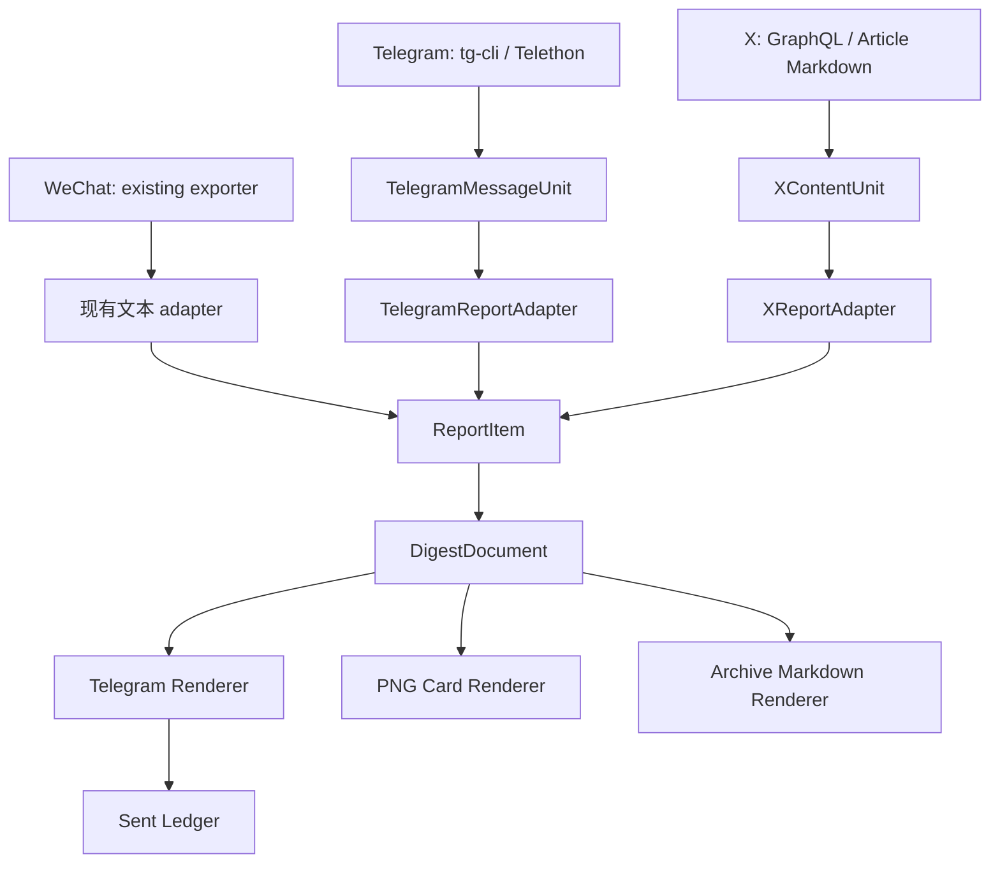

# Spec: Telegram + X 结构化内容与统一报告管线

日期：2026-07-17

状态：方向已确认，**仅设计、不实施**

范围：`chat-daily-tg` 的 Telegram 来源、BWG `/root/x_monitor` 的 X 来源，以及二者进入统一 report 的结构化边界

## 1. 问题

当前系统已经能稳定完成两类投递：

- Mac 上的 `chat-daily-tg`：微信 / Telegram 群摘要、Telegram 频道原文卡、图片理解、健康简报等。
- BWG 上的 `x_monitor`：X 多账号监控、普通推文 / 长推 / Article 富消息、媒体拼图、跨账号去重和 Telegram 话题路由。

两边的问题不是“没有内容”，而是**结构化信息没有形成可复用的中间层**：

1. Telegram 文本、媒体和相册信息来自不同路径。公开频道的 tg-cli 数据缺少媒体和 `grouped_id`，相册需要按连续 ID + 10 秒窗口推断；Telethon 旁路虽然已有真实 `grouped_id`，但没有成为统一数据源。
2. 日报的精简版由 LLM 先生成 Markdown，PNG 卡片再按标题关键词把 Markdown 解析回结构；格式轻微漂移即可造成栏目或字段丢失。
3. X Monitor 已经获得 tweet、note、Article、转推、引用、媒体、互动数据等结构，但成功后主要留下 seen IDs 和只含 `{ts, by}` 的 pushed index，无法被 Mac 日报重用。
4. Telegram 是最终接收端，但源内容、报告语义和 TG 投递状态仍混在各自 pipeline 中，没有统一的“来源事实 → 报告条目 → TG 投影”边界。

本设计要解决的本质问题是：

> 各来源保留自己的完整语义，再通过确定性 adapter 映射为通用报告条目；Telegram 只负责展示与注意力分配，不成为事实源。

## 2. 已核查事实

### 2.1 `chat-daily-tg`

- 日报、频道转发、growth、B站是相互隔离的批处理管线；增强阶段失败不得阻塞主内容投递。
- `telegram_exporter.py` 从 tg-cli SQLite 读取文本；库中 `raw_json` 缺失，不能可靠获得媒体、转发详情和相册 `grouped_id`。
- `tg_media_dump.py` 已通过 Telethon 获得 `msg_id / date / text / html / grouped_id / media`，并按高水位从最旧 backlog 向前消费；该能力目前主要服务私有频道和图片旁路。
- `private_media.group_posts()` 已能按真实 `grouped_id` 合并相册；公开频道路径仍用启发式推断。
- 日报 prompt 产出 concise Markdown；`card_renderer.py` 再按 `###` 标题关键词解析成 PNG 栏目。
- Telegram sender 已返回 `message_id`，但没有覆盖所有 producer 的统一 sent ledger。
- 现有幂等、去重和投递状态必须保持分层：source seen、content dedup、delivery marker、run complete 不能互相替代。

### 2.2 BWG `x_monitor`

2026-07-17 通过 SSH 只读核查 `/root/x_monitor`：

- `*/30` cron 一次性运行，`flock` 防重入，不是常驻服务。
- Twitter GraphQL 为主数据源；认证 cookie 失败可降级 guest，并有 query ID 刷新与账号失败健康状态。
- GraphQL 已规范化：tweet ID、全文、时间、URL entities、媒体、尺寸、视频 variants、conversation ID、互动数、note tweet、Article、转推和引用关系。
- 普通推文优先 Rich HTML；媒体支持照片 / 视频 / GIF 和 collage，失败后回落 HTML。
- Article 使用持久队列，包含 `pending / processing / failed / sent` 等状态；抓 Markdown 后生成中文摘要，支持封面、正文配图、折叠细节与 Rich Message 回退。
- 纯转推按原推 ID 去重；引用壳保留为新内容；Article 使用 `a:<article_id>` identity。
- 当前 `.pushed_index.json` 只保存 canonical key、时间和发现账号，适合 dedup，不足以生成 report。
- 当前账号路由 `default / ai_cn / biz` 是 Telegram topic 路由，不是稳定的日报内容分类。
- 远端工作树已有用户未提交修改；本设计未修改远端任何文件。

## 3. 目标与非目标

### 3.1 目标

1. 为 Telegram 和 X 各定义一个来源专用的结构化内容单元。
2. 用 adapter 把来源单元映射为统一 `ReportItem`，而不是让通用 report 理解 tg-cli、GraphQL 或 Article 队列。
3. 用结构化 `DigestDocument` 作为 Telegram 文本、PNG 卡片和本地 Markdown 的共同事实输入。
4. 让 BWG 的 X 内容形成可同步、可审计、可幂等导入的事件出口。
5. 保留现有批处理、失败隔离、write-after-send、投递优先和降级路径。
6. 允许逐 producer、逐来源灰度，不要求一次性迁移全部来源。

### 3.2 非目标

- 不引入常驻 MTProto / X listener。
- 不部署 Condenser、telememo、Web 阅读器或 iOS 客户端。
- 不让 Web UI 或 Telegram bot 直接触发生产抓取、重发或配置修改。
- 不在本阶段实现 reaction、clips 或 TG 内 LLM agent。
- 不把微信、Telegram、X 强行压成同一种原始 schema。
- 不用“已读”状态控制采集、去重或投递。
- 不改动当前生产代码、cron、launchd、TG 路由或 BWG 配置。

## 4. 备选方案

### 方案 A：继续以 Markdown / 文本为集成接口

各来源维持现状，X 通过 SSH 导出 Markdown，Telegram 继续向 LLM 提供带前缀文本。

优点：改动最少。

缺点：丢失相册、引用、转推、媒体、identity、互动快照和 delivery lineage；日报 renderer 继续依赖字符串猜结构。

结论：不选。它保留了本设计要解决的根问题。

### 方案 B：所有来源直接写入一个通用大表

Telegram、X、微信统一使用同一套原始字段。

优点：查询表面统一。

缺点：X 的转推 / 引用 / Article / thread 与 Telegram 的相册 / forward 语义不同；最终会形成大量 nullable 字段和来源特例，通用层反而理解所有 transport。

结论：不选。统一发生得过早。

### 方案 C：来源专用模型 + adapter + 通用报告模型（采用）

Telegram 保留 `TelegramMessageUnit`，X 保留 `XContentUnit`；两者分别经 adapter 映射到 `ReportItem`，最后组成 `DigestDocument`。

优点：来源事实完整、职责清晰、可独立演进、可逐步迁移、renderer 可确定性复用。

代价：需要维护两个来源 schema 和 adapter；必须做 schema version 与兼容测试。

结论：采用。复杂度放在明确边界上，而不是散落在每个 producer 和 renderer 中。

## 5. 总体架构



### 核心不变量

1. 来源 adapter 之前保留完整来源语义；adapter 之后不泄漏 transport 细节。
2. `DigestDocument` 是 report 展示的唯一结构事实；Markdown 与 PNG 都是派生视图。
3. archive / SQLite / X event snapshot 是可恢复事实源；Telegram 是投递投影。
4. LLM 可以提出结构内容，但所有枚举、identity、来源、链接、媒体引用和渲染必须由代码校验。
5. 新结构失败时必须回退现有稳定路径，不允许整份日报零产出。

## 6. 来源模型

### 6.1 `TelegramMessageUnit`

```text
schema_version
identity
  chat_id
  primary_message_id
  raw_message_ids[]
  grouped_id?
source
  channel_name
  username?
  sender_id?
  sender_name?
  published_at
content
  text
  html
  webpage?
relationship
  is_forwarded
  forward_source?
media[]
  message_id
  kind
  local_path / remote_ref
  width / height / duration
delivery_policy
  raw / summary / both
  target_topic
  dedup_enabled
```

语义要求：

- 一个相册是一个 unit，`raw_message_ids` 保存全部成员；所有成员送达终态后一起推进 seen。
- 公开和私有频道最终消费同一 unit，不再让 renderer 猜相册。
- `webpage.url` 优先于“正文第一个 URL”；正文正则只作兼容回落。
- forward source 必须和当前频道分开，不能只显示 `[转发]`。
- 现有 `tg_media_dump.py` 可扩展字段，但迁移初期 tg-cli 文本路径必须继续作为 fallback。

### 6.2 `XContentUnit`

```text
schema_version
identity
  event_id                # t:<id> / a:<article_id> / c:<conversation_id>
  tweet_id
  canonical_key
  conversation_id
  kind                    # tweet / note / retweet / quote / thread / article
provenance
  observed_via            # 被监控账号
  canonical_author        # 原始作者
  author_role             # official / engineer / researcher / curator / business
  created_at
  fetched_at
  fetch_mode              # authenticated / guest
  source_url
content
  raw_text
  expanded_text
  language
  article_title?
  article_markdown_ref?
relationship
  retweeted_tweet_id?
  quoted_tweet_id?
  quoted_author?
  quoted_text?
  raw_tweet_ids[]
media[]
  type / url / width / height / duration / variants
metrics
  likes / retweets / replies
  captured_at
classification
  filter_verdict / reason
  report_topics[]
  novelty / authority / relevance
enrichment
  headline_zh / summary_zh
  why_it_matters / next_action
  risk / confidence / backend
delivery
  status / chat_id / thread_id / telegram_message_ids[] / sent_at
```

语义要求：

- `observed_via` 与 `canonical_author` 永远分开；策展账号发现官方信息不能改变事实归属。
- 纯转推 canonical key 穿透到原推；引用壳保留自身 ID，因为评论是新增内容。
- Article identity 使用 `a:<article_id>`，与分享该 Article 的 tweet 壳分离。
- engagement 是带 `captured_at` 的快照，不是永久值，也不能直接跨账号比较。
- guest 降级获取的记录必须带 completeness / fetch mode，不能伪装成完整认证结果。
- 原始 X 文本与 AI enrichment 分开保存，report 必须能回到原始证据。

## 7. 通用报告模型

### 7.1 `ReportItem`

```text
id
platform                 # telegram / x / wechat / ...
type                     # official_release / ai_tool / research / business / opinion / risk / resource
headline
summary
why_it_matters?
next_action?
source_refs[]
discovered_via[]
links[]
media_refs[]
risk?
confidence
evidence_refs[]
novelty
```

规则：

- `headline + summary` 回答“发生了什么”。
- `why_it_matters` 是判断，不得和来源事实混为一句无归属陈述。
- `next_action` 只在存在明确、低风险动作时输出；不能为了填字段强行建议。
- source refs 从来源对象确定性复制，禁止 LLM 猜作者、群名或平台。
- evidence refs 必须能定位 archive、tweet URL、Telegram chat/message 或 X event snapshot。
- 同一事实跨 Telegram / X 出现时可合并一个 `ReportItem`，但保留全部 source refs。

### 7.2 `DigestDocument`

```text
date
generated_at
source_freshness[]
overview[]
sections[]
  type
  title
  items[]: ReportItem
resources[]
warnings[]
detail_archive_path
```

Telegram、PNG 和 archive renderer 只读取该对象。LLM 结构解析失败时：

1. 尝试 code-level repair / normalization。
2. 仍失败则使用当前 concise Markdown 路径。
3. 记录降级原因，但不得阻塞投递。

## 8. Telegram 展示设计

### 8.1 原文频道卡

```text
📢 频道名 · 10:42
↪️ 转发自：原频道（如适用）

正文

互动 / 媒体提示（仅有意义时）
[打开原文]
```

- 相册作为一个逻辑单元；媒体组和正文消息通过 reply 关系连接，按钮只出现一次。
- 页面预览优先使用结构化 webpage；无结构数据时回退现有 permalink / content link 规则。
- 媒体失败降级正文，正文失败不得先写 seen。

### 8.2 X 即时推送

普通原创：作者、结论或完整正文、媒体、必要的相对热度、原文按钮。

纯转推：显式写“发现账号转发原作者”，正文归原作者。

引用：分开显示引用者评论与被引用原文，不能拍平成一段。

Thread：高价值自回复 thread 合并为一个 unit，低价值讨论不抓完整回复树。

Article：标题 / 作者 / 封面 / 核心论点 / 关键结论 / 可折叠论证 / 正文配图。

### 8.3 日报栏目

通用日报仍按价值而非平台分栏；X 独立预览可使用：

- X 今日主线
- 官方发布
- AI / 工具
- 技术 / 研究
- 观点 / 讨论
- 商业 / 宏观
- 长文深读
- 风险 / 待验证
- 值得打开

`default / ai_cn / biz` 只负责路由，不直接决定 report type。

## 9. X 事件出口与跨机同步

### 9.1 BWG 双写出口

初期不迁移现有 JSON 状态机，只增加 append-only 双写：

```text
/root/x_monitor/x_events/YYYY-MM-DD.jsonl
```

事件类型：

- `fetched`：规范化内容快照和 fetch completeness。
- `classified`：过滤、主题、价值判断。
- `enriched`：Article / 长推摘要及模型信息。
- `delivered`：TG message IDs、target、sent time。
- `delivery_failed`：确定失败；ambiguous delivery 单独标记，不能等同 definite failure。

每行带 `event_id + sequence/time + schema_version`；导入端按 event identity 幂等折叠。写事件失败不得阻塞即时 X 推送，但必须告警，因为这会造成日报缺口。

### 9.2 Mac 同步

日报启动前执行有超时的只读同步：

```text
BWG x_events
  → rsync/scp 临时文件
  → 原子替换本地镜像
  → 幂等导入 chat-daily.db
```

约束：

- 不能在 report 主流程里远程执行 GraphQL。
- SSH / Tailscale 失败时使用最后成功镜像，其他来源继续。
- `source_freshness` 明示“X 数据截至时间”；过旧则 warnings 显示，不假装最新。
- 同步使用临时文件 + 校验 + rename，不让半文件进入 importer。
- pushed index 继续作为轻量跨生产者 identity index，但不再充当 report feed。

## 10. X 获取增强顺序

1. **完整事件快照**：先保存已有 GraphQL 结构，停止成功后只剩 seen ID。
2. **引用正文**：当前已有引用 ID / 作者，补被引用正文和必要媒体，才能判断“评论了什么”。
3. **高价值 thread**：利用 `conversation_id` 按需补抓同作者自回复，不抓所有讨论。
4. **来源元数据**：账号配置增加 `role / trust_tier / language / report_topics`。
5. **相对热度**：按账号历史基线计算异常热度；绝对互动量只作次级排序信号。

来源元数据示例：

```json
{
  "username": "OpenAIDevs",
  "enabled": true,
  "role": "official",
  "trust_tier": "primary",
  "language": "en",
  "report_topics": ["official_release", "engineering"]
}
```

可信度规则：官方账号可支撑“官方发布”；策展账号只能支撑“该账号推荐 / 评论”，除非原始链接回到一手来源。

## 11. 投递状态与 sent ledger

所有 renderer 成功后写统一 ledger：

```text
producer
source_item_id
payload_hash
target_chat_id
thread_id
telegram_message_ids[]
sent_at
delivery_shape            # rich / text_chunks / media_group / fallback
```

约束：

- 仅 Telegram 明确成功并返回 message ID 后登记 definite delivery。
- 网络超时造成的 ambiguous delivery 单独记录；不能同时保证绝不漏与绝不重，系统继续选择“投递优先，允许极少重复”。
- read、seen、dedup、delivered、saved / clipped 是不同状态，不得复用一个布尔值。
- 日报阶段 marker 继续存在；ledger 提供消息级反查，不替代 day-level state machine。

## 12. 错误处理

| 故障 | 行为 |
|---|---|
| Telegram 结构化采集失败 | 回退现有 tg-cli / 文本路径；不阻塞其他来源 |
| X GraphQL 认证降级 guest | 标记 fetch mode / completeness；继续可用数据 |
| X event 双写失败 | 即时推送继续，发送告警；日报显示数据缺口 |
| BWG → Mac 同步失败 | 使用最后成功镜像并显示 freshness warning |
| Adapter schema 不兼容 | 隔离该 item、记录死信；其余 item 继续 |
| LLM JSON 不合法 | code repair → 现有 Markdown fallback |
| Rich Message 被拒 | 现有 HTML / 文本 / 媒体降级链 |
| 媒体下载或远端 URL 失败 | 保留正文和原文链接，不把整个 item 判失败 |
| sent ledger 写失败 | 投递已发生，不重发；高优告警并保留 producer marker |

## 13. 对抗式风险审查

### P0 / 必须在实现前收死

1. **高水位越过 backlog**：增量抓取必须从最旧未处理消息消费，不能取最新一页后推进水位。
2. **错误事实归属**：转推发现者、原作者、引用者、Article 作者必须分字段；任何 fallback 不得错署名。
3. **投递与状态写入竞态**：必须 send-then-mark；状态失败导致重复优于 mark-before-send 导致永久漏发。
4. **跨机半文件**：同步必须临时文件 + 原子替换，不能直接读取传输中的 JSONL。

### P1 / 本次设计已给出约束

1. X GraphQL 是非官方接口，query shape、cookie 和 guest 完整度会漂移；schema 层必须记录来源健康。
2. X engagement 是不同抓取时点的快照，不能直接跨账号比较或作为事实优先级唯一依据。
3. LLM 会接触不可信 X / 群聊正文；它只生成 report data，不获得执行、配置或重发权限。
4. Article `enriched` 晚于 tweet `fetched`，importer 必须支持同一 identity 的后续事件折叠。
5. Telegram 富消息、相册和分块可能返回多个 message IDs；ledger 不能假设一对一。

### P2 / 观察后再决定

1. 是否把相对热度纳入排序，以及各账号基线窗口。
2. 是否为高价值 thread 增加专门 GraphQL 请求预算。
3. 是否把 X 独立日报长期保留，还是只把高价值 X item 合入主日报。

## 14. 分阶段实施边界（未来，不在本次执行）

### Phase 0：设计冻结与样本验证

- 用真实 Telegram 相册、转发、链接预览样本验证 `TelegramMessageUnit`。
- 用原创、纯转推、引用、note、Article 样本验证 `XContentUnit`。
- 只做离线 fixture 和 renderer preview，不接生产投递。

### Phase 1：结构化双写，不改变现有推送

- BWG 写 X event JSONL。
- Mac 扩展 Telethon manifest 字段。
- 新路径与旧路径并行比对，不作为生产输入。

### Phase 2：XReportAdapter + 独立预览

- 同步 BWG events 到 Mac。
- 生成本地 X report 和 `--no-push` TG preview。
- 对照当日真实 X 推送核查遗漏、错署名和重复。

### Phase 3：结构化 DigestDocument 灰度

- Telegram / PNG / archive 从同一结构渲染。
- 先对一个 producer 或测试 topic 启用。
- Markdown fallback 保留至少一个完整观察窗口。

### Phase 4：来源增强

- 引用正文、thread、来源 metadata、相对热度。
- 按度量决定是否进入主日报；不因架构已存在而强行上线功能。

## 15. 验收标准

1. Telegram 相册无论公开或私有都表现为一个 unit，全部成员 ID 可审计。
2. X 原创、转推、引用、Article 的作者归属在结构数据和最终 TG 中一致。
3. 同一 X 原推被多个监控账号纯转发时，report 只有一个事实 item，但保留全部 discovered_via。
4. X event 同步失败不会阻塞微信 / Telegram 日报，且报告显示真实 freshness。
5. 同一 `DigestDocument` 生成的 TG、PNG 和 archive 栏目与 item 数一致。
6. 结构解析或 renderer 失败时能回退现有 Markdown 路径并成功投递。
7. 每个已送达 item 可由 sent ledger 反查来源 identity、目标 topic 和全部 TG message IDs。
8. 无任何路径用 read 状态抑制抓取或投递。
9. 全量测试覆盖 schema version、坏 JSONL、重复事件、乱序事件、跨日边界、未来时间戳、媒体失败、429、超时 ambiguous delivery 和部分发送。

## 16. Go / No-Go

进入生产灰度前必须同时满足：

- 至少 7 天并行双写无源内容丢失。
- Telegram unit 与旧路径样本对照：零相册拆错、零作者错署。
- X report 人工抽样：零官方 / 策展来源混淆，纯转推重复率显著下降。
- BWG 同步失败演练确认主日报继续且 freshness 可见。
- 结构化 renderer 与现有 Markdown fallback 均通过真实 Telegram 测试 topic 验证。

任一 P0 不变量无法证明时 No-Go，继续保留现有生产路径。

## 17. 最终决策

采用“来源专用结构 → adapter → 通用报告 → Telegram 投影”的分层设计：

- Telegram 通过 `TelegramMessageUnit` 统一文本、相册、转发、网页预览与媒体。
- X 通过 `XContentUnit` 保留原创、转推、引用、thread、Article、互动快照和发现链路。
- `ReportItem / DigestDocument` 只承载报告语义，不理解来源 transport。
- BWG 增加 append-only X event 出口，Mac 以有超时、可回退的镜像方式消费。
- 现有批处理与推送路径在完成并行验证前保持不变。

本 spec 到此停止；不自动进入 implementation plan 或代码实现。
